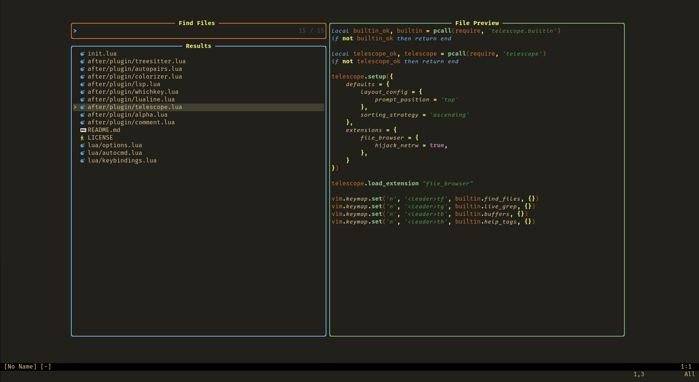

# <p align="center">Mechanicus NVim</p>

<p align="center">


</p>
My personal neovim config, complete with colorscheme. I mostly maintain it for myself. The config will be updated to accomodate any breaking changes made to the used plugins. Use at your own risk. Send a PR if you have any ideas. 

---




---

# Requirements 
* [Neovim](https://github.com/neovim/neovim/releases/latest) - The latest stable version
* [Nerd Fonts](https://www.nerdfonts.com/font-downloads) - I personally use FiraCode for regular and bold and Code New Roman for italic (since FiraCode doesn't have italics)
* [ripgrep](https://github.com/BurntSushi/ripgrep) - Telescope uses ripgrep as a dependency. For Linux, it should be present in the default package repos.

---

# Installation

Simply clone the repo into your nvim configuration folder.

```
git clone https://github.com/IneptusMechanicus/neovim-config.git .config/nvim
```
Once the download is complete, simply run Neovim. The config is written so that it will install all necesarry plugins on first startup. The `alpha` dashboard won't appear until the next time you start neovim.

---

# Plugins used
* Package Manager
  * [Lazy.nvim](https://github.com/folke/lazy.nvim)
* Basic UI and Layout
  * [Alpha](https://github.com/goolord/alpha-nvim) - Welcome Screen
  * [Lualine](https://github.com/nvim-lualine/lualine.nvim) - Status line
  * [WhichKey](https://github.com/folke/which-key.nvm) - Status line
  * [Color Scheme](https://github.com/IneptusMechanicus/mechanicus.nvim) - Status line
  * [Colorizer](https://github.com/NvChad/nvim-colorizer.lua) - Colorize hex values
* File Management
  * [Telescope](https://github.com/nvim-telescope/telescope.nvim) - Fuzzy Finder
  * [Telescope File Browser](https://github.com/nvim-telescope/telescope-file-browser.nvim) - File Browser
  * [Harpoon](https://github.com/ThePrimeagen/harpoon) - File Quicklist
* Coding stuff
  * [Treesitter](https://github.com/nvim-treesitter/nvim-treesitter) - Syntax Highlighting
  * [LSP Zero](https://github.com/VonHeikemen/lsp-zero.nvim) - Easy LSP setup
  * [Nvim Comment](https://github.com/terrortylor/nvim-comment) - Hotkey commenting
  * [Autopairs](https://github.com/windwp/nvim-autopairs) - Automatic parentheses
