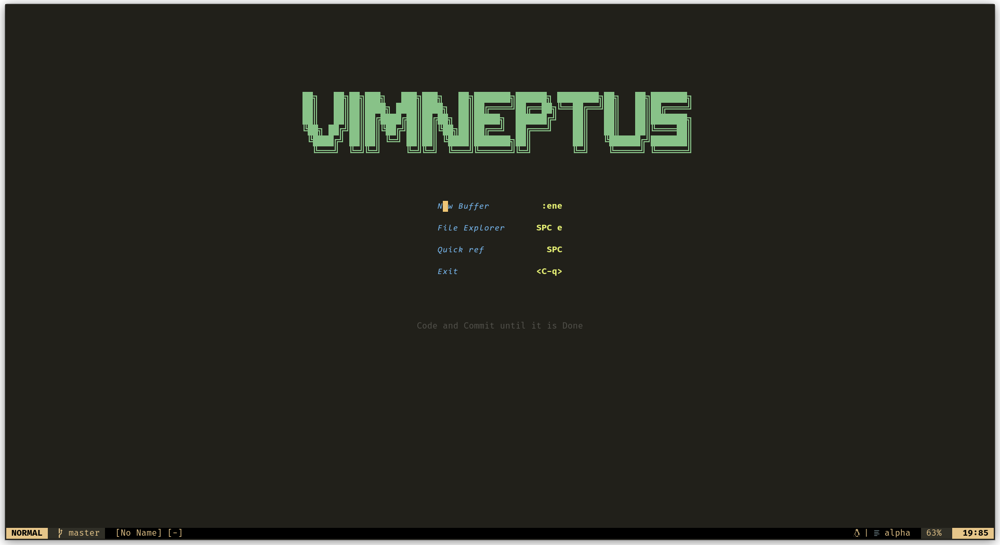
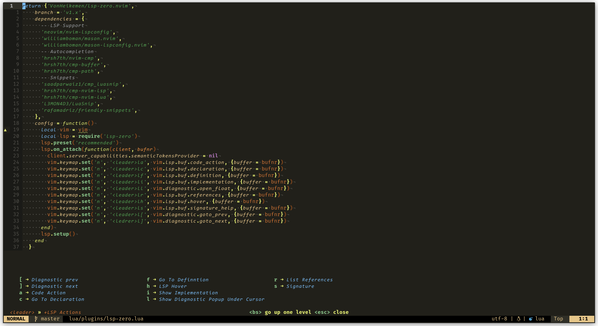
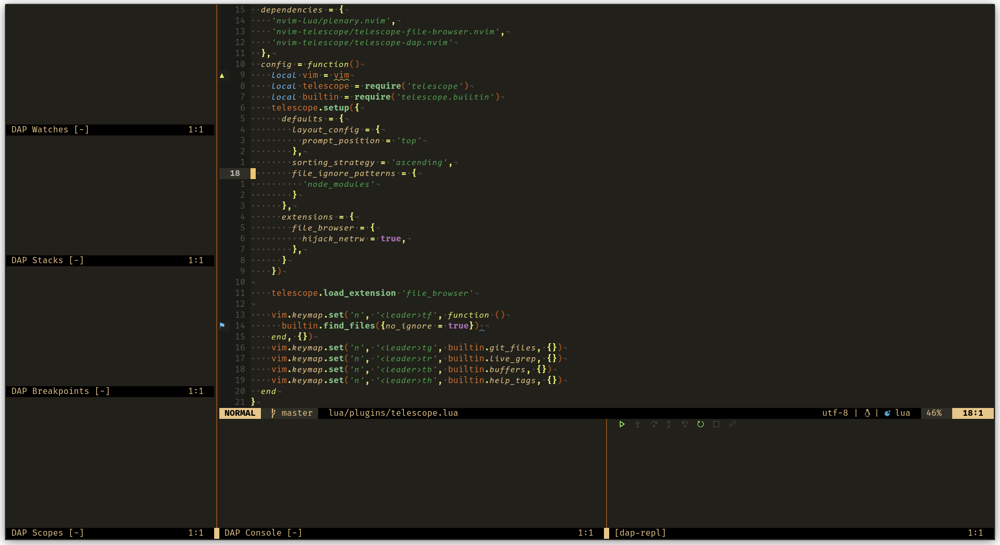

# <p align="center">VIMNEPTUS</p>

<p align="center">
    
    
</p>
My personal neovim config, complete with colorscheme. It's somewhere in the middle of being just a personal config and a "distro". I believe the preinstalled packages are sufficient, though stuff like LSPs and Debuggers only span my personal scope. Keybindings are also not the most universal, they mostly follow my own logic.

---

<p align="left">
    
    
</p>
<p align="left">
    
    
</p>

---

## Requirements

### Base
* [Neovim](https://github.com/neovim/neovim/releases/latest) - The latest stable version
* [Nerd Fonts](https://www.nerdfonts.com/font-downloads) - I personally use FiraCode for regular and bold and Code New Roman for italic (since FiraCode doesn't have italics)

### Telescope
* [ripgrep](https://github.com/BurntSushi/ripgrep) - Telescope uses ripgrep as a dependency for Live Grep Searching through files. For Linux, it should be present in the default package repos.

### Debuggers
This config have an nvim-dap setups for PHP, Rust, GDScript and NVim Lua.
For further info on the setup and required packages, look at the [Debugger Adapter Installation Guide](https://github.com/mfussenegger/nvim-dap/wiki/Debug-Adapter-installation) for `nvim-dap`

---

## Installation

Simply clone the repo into your nvim configuration folder.

#### Linux:

```bash
git clone https://github.com/IneptusMechanicus/neovim-config.git .config/nvim
```
#### Windows

No clue. Who uses Neovim on Windows anyway?

#### MacOS

I've only ever touched an Apple device once. I think the setup is more or less similar to Linux, but don't quote me on that.

---

Once the download is complete, simply run Neovim. The config is written so that it will install all necessary plugins on first startup. The `alpha` dashboard won't appear until the next time you start neovim.

## Plugins used

* Plugin Manager
    * [Lazy.nvim](https://github.com/folke/lazy.nvim)
* Basic UI and Layout
    * [Alpha](https://github.com/goolord/alpha-nvim) - Welcome Screen
    * [Lualine](https://github.com/nvim-lualine/lualine.nvim) - Status line
    * [WhichKey](https://github.com/folke/which-key.nvm) - Key binding helper
    * [Mechanicus.nvim](https://github.com/IneptusMechanicus/mechanicus.nvim) - Color scheme
    * [Colorizer](https://github.com/NvChad/nvim-colorizer.lua) - Colorize hex values
    * [Noice](https://github.com/folke/noice.nvim) - UI Enhancements for command line, notifications and search
* File Management
    * [Telescope](https://github.com/nvim-telescope/telescope.nvim) - Fuzzy Finder
        * [Telescope File Browser](https://github.com/nvim-telescope/telescope-file-browser.nvim) - File Browser
        * [Telescope DAP](https://github.com/nvim-telescope/telescope-dap.nvim) - Integrating DAP Client with Telescope
    * [Harpoon](https://github.com/ThePrimeagen/harpoon) - Shortlist of files you'd work on in a given session
* Coding stuff
    * [Treesitter](https://github.com/nvim-treesitter/nvim-treesitter) - Syntax Highlighting
    * [LSP Config](https://github.com/neovim/nvim-lspconfig)- Easy LSP setup
        * [Mason](https://github.com/williamboman/mason.nvim) - LSP/DAP/Linter/Formatter plugin manager
        * [Mason LSP Config](https://github.com/williamboman/mason-lspconfig.nvim) - Bridge LSP and Mason
    * [NVim CMP](https://github.com/hrsh7th/nvim-cmp) - Code Completion
        * [NVim CMP LSP](https://github.com/hrsh7th/cmp-nvim-lsp) - Completions source for LSP
        * [Luasnip](https://github.com/L3MON4D3/LuaSnip) - Snippet Engine
        * [CMP Luasnip](https://github.com/saadparwaiz1/cmp_luasnip) - Luasnip completion source for NVim CMP
        * [Friendly Snippets](https://github.com/rafamadriz/friendly-snippets) - Extra snippets collection
    * [NVim DAP](https://github.com/mfussenegger/nvim-dap) - DAP Client for debugging
        * [NVim DAP UI](https://github.com/rcarriga/nvim-dap-ui) - UI tools for DAP inside Neovim
        * [One small step for Vim kind](https://github.com/jbyuki/one-small-step-for-vimkind) - Debug adapter for Lua inside Neovim
    * [NVim Comment](https://github.com/terrortylor/nvim-comment) - Hotkey commenting
    * [Autopairs](https://github.com/windwp/nvim-autopairs) - Automatic parentheses
    * [DiffView](https://github.com/sindrets/diffview.nvim) - Managing diffs and merge conflicts

This config has been written with the help and inspiration from the Neovim guides by [The Primeagen](https://github.com/ThePrimeagen) and [Chris Power typecraft](https://github.com/cpow)
